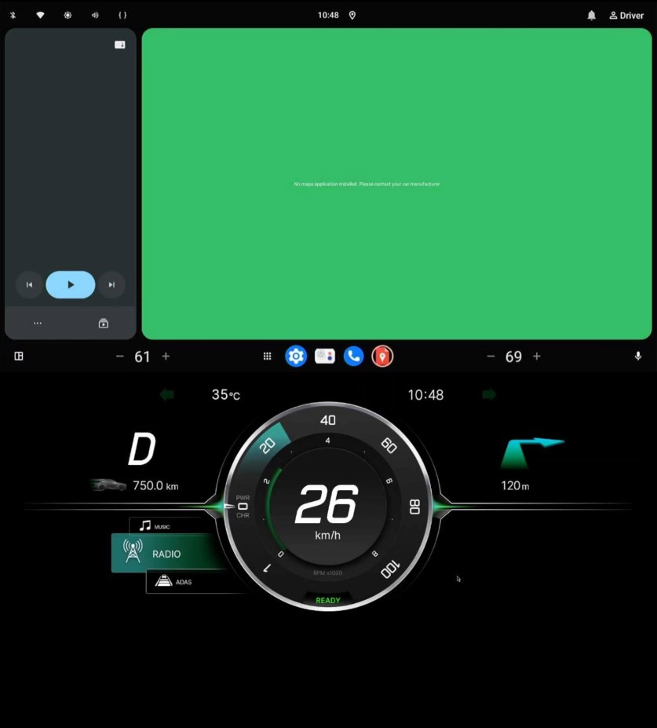

# Android 15 on Xen with AGL reference cluster

## Disclaimer

This is not perfect guide, just a memo as of now.
If you need step by step guide, this is not suitable.
But, this may helps some experts and me in the future.

## Env

- HW
  - R-Car H3 evaluation board(Note: 4GB model is not supported)
    - HDMI0: Onlap touchpanel
    - HDMI1: Monitor(FHD recomended because reference cluster fixed to FHD)
- SW
  - Base
    - https://github.com/xen-troops/meta-xt-prod-devel-rcar
  - Additional for Demo
    - layers/meta-xxx
    - demo.yaml
- Target board list
  - H3SK + CCPF-SK
  - H3SK + Kingfisher
  - Salvator-XS with H3

## How to build

- git clone https://github.com/yhamamachi/meta-rcar-demo -b android_on_xen_with_agl_cluster_v1
- Copy GFX/MMP evaluation package into proprietary directory.
  - You can donload from following link
    - https://www.renesas.com/application/automotive/r-car-h3-m3-h2-m2-e2-documents-software
- Then, run build_xen_doma_agl_cluster.sh <board_name>
  - Run build_xen_doma_alg_cluster.sh without argument to see usage
  - If build is success, firmware directory and full.img.gz are stored into meta-xt-\* directory.

```
Directory structure:
|--build_xen_doma_agl_cluster.sh
|--demo.yaml
|--layers/
|--proprietary/
   |--R-Car_Gen3_Series_Evaluation_Software_Package_for_Linux-20220121.zip
   |--R-Car_Gen3_Series_Evaluation_Software_Package_of_Linux_Drivers-20220121.zip
```

## How to setup the demo

1. Flash firmware to board.
   - I recomend to use https://github.com/morimoto/renesas-bsp-rom-writer. This is useful for flashing firmware.
2. Setup U-boot
   - See also https://github.com/xen-troops/meta-xt-prod-devel-rcar/blob/master/doc/u-boot-env.md
```
bootcmd=env delete bootargs; run bootcmd_emmc
bootcmd_emmc=env delete bootargs; run emmc_xen_load; run emmc_dtb_load; run emmc_kernel_load; run emmc_xenpolicy_load; run emmc_initramfs_load; bootm 0x48080000 0x84000000 0x48000000
mmc0_dtb_load=ext2load mmc 0:1 0x48000000 /boot/dom0.dtb; fdt addr 0x48000000; fdt resize; fdt mknode / boot_dev; fdt set /boot_dev device mmcblk1
mmc0_initramfs_load=ext2load mmc 0:1 0x74000000 /boot/uInitramfs
mmc0_kernel_load=ext2load mmc 0:1 0x7a000000 /boot/Image
mmc0_xen_load=ext2load mmc 0:1 0x48080000 /boot/xen-uImage
mmc0_xenpolicy_load=ext2load mmc 0:1 0x7c000000 /boot/xenpolicy
flash_xen_emmc=tftp 0x500000000 full.img.gz; gzwrite mmc 1 0x500000000 ${filesize} 1000000 0
initrd_high=0xffffffffffffffff
```
3. Flash full.img.gz into eMMC
   -  Setup TFTP server on your Host PC and copy full.img.gz into tftp root directory.
   - After setup network config on the board, execute 'run flash_xen_emmc' on U-Boot.

### Fix Y-axis gap on touchscreen(it needs to run at once)

This is caused by that Y-axis max set to 1440 but using 1920x1080 device.
Touchpanel config file is sent to DomA and force to fix X-axis max to 1920 nad U-axis max to 1080.
If you can ignore this, please skip this step.

1. Setup ADB environment for DomA
   - Setup network on your host PC to be able to connect DomA.
     - Network routing configuration is required because DomA is behind the DomD and has no same subnet.
   - Execute "adb connect 192.168.2.4:5555" on your host PC.
   - After that, you can use adb command as same as using USB cable.
2. Run misc/push_idc.sh to adjust touchscreen axis.
   - DomA will be rebooted by this script.

## How to run Demo

- Just power on.

### Screenshot(upper side is DomA, bottom side is DomD)



